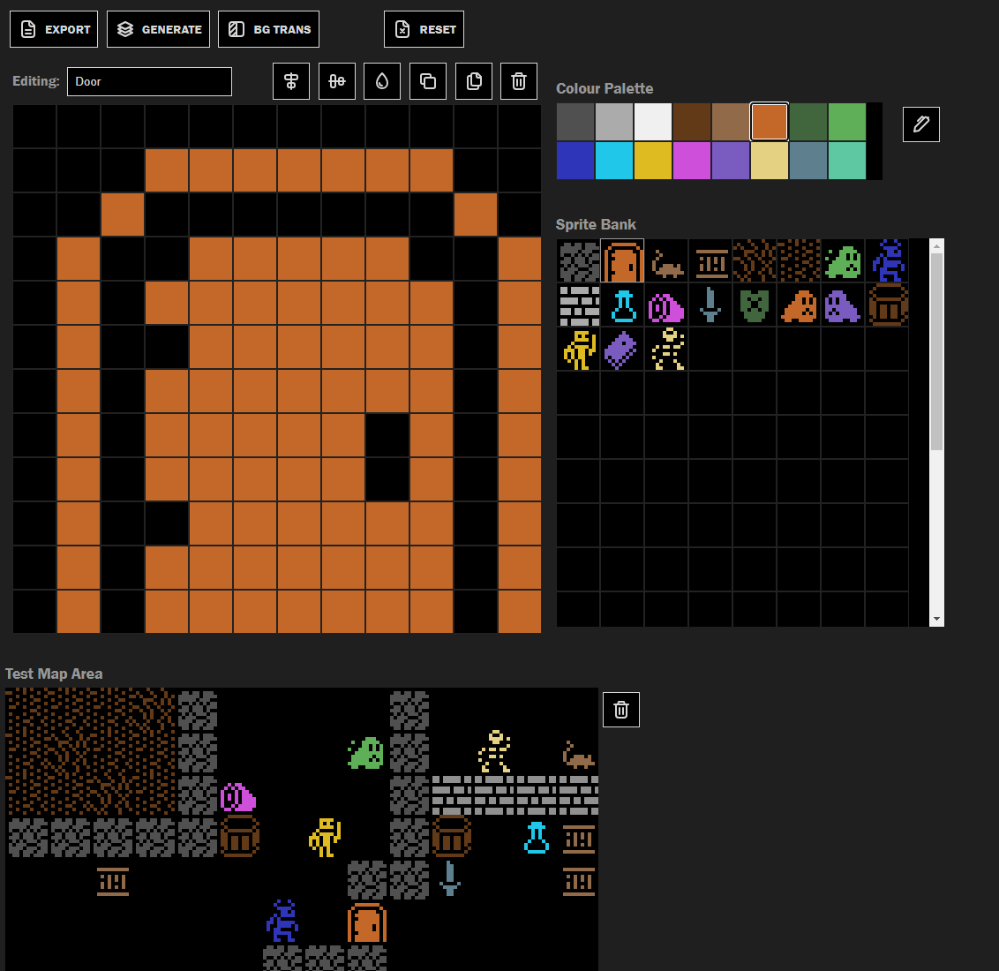

# WASM and Go Roguelike

This is a very, very, veeeeery work in progress classic & retro style roguelike being developed in Go targeting WASM for running in browsers.

Nothing more to say here until there's a working prototype 😊

## Sprite Editor

A separate sprite editor has been developed to aid with creating sprites

[Sprite Editor](./sprite-editor/readme.md)

