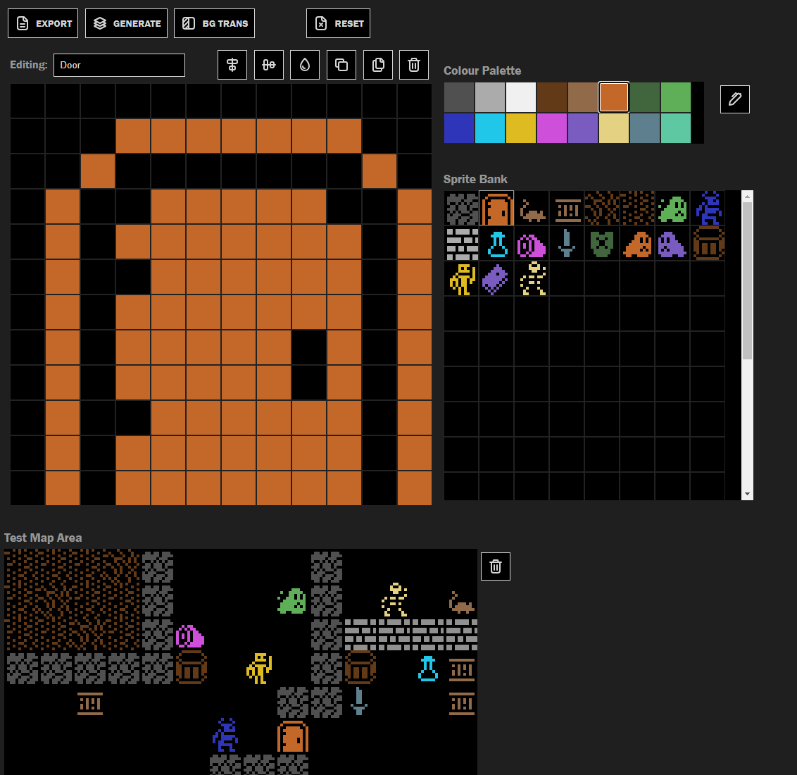

# Go Roguelike

This is a very, very, veeeeery work in progress classic & retro style roguelike being developed in Go targeting WASM for running in browsers.

Nothing more to say here until there's a working prototype 😊

## Project Status

Deployed versions to try out:

- [🕹️ Game](http://code.benco.io/roguelike/)
- [📝 Sprite Editor](http://code.benco.io/roguelike/sprite-editor)

## Screens

## Sprite Editor

A separate sprite editor has been developed to aid with creating sprites

[Sprite Editor](./sprite-editor/readme.md)

## Plan and Todo List:

- [ ] HUD
  - [x] Status bar
- [x] Events
- [ ] Level generation
  - [ ] Multiple levels
  - [ ] Generation using BSP
  - [ ] Generation using WFC
  - [ ] Generation using Cellular Automata
- [ ] Inventory system
  - [ ] Scriptable items using JS
  - [ ] Pick up items
  - [ ] Drop items
  - [ ] Use items
- [ ] Implement creatures/monsters
  - [ ] Scriptable AI using JS
  - [ ] Combat
- [ ] Implement furniture
  - [ ] Doors
- [ ] Timing & energy system
