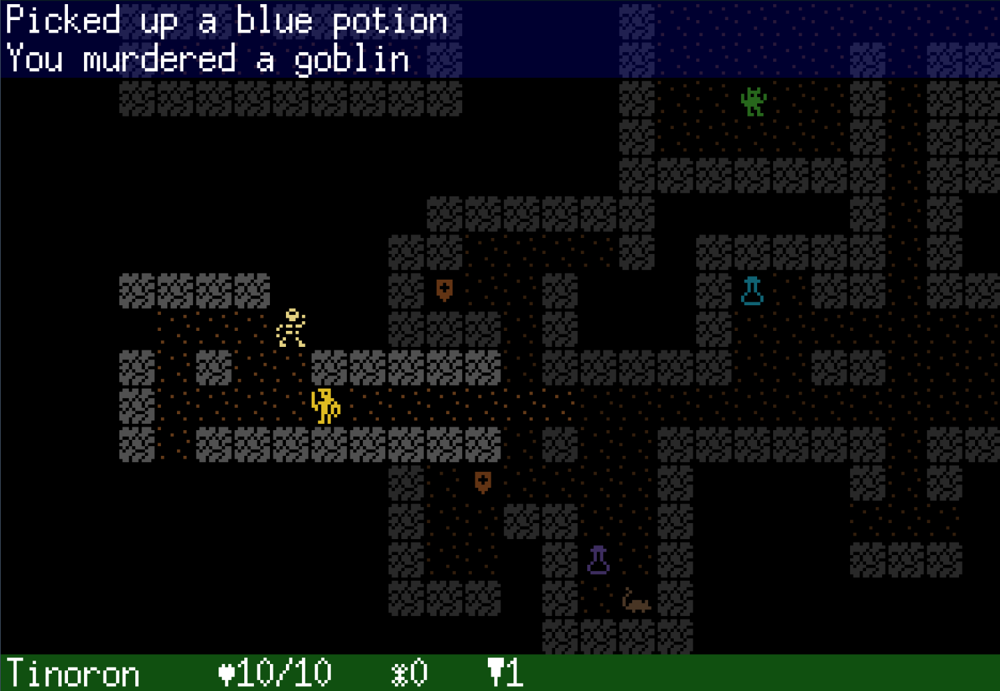

# Go Roguelike

This is a very, very, veeeeery work in progress classic & retro style roguelike being developed in Go targeting WASM for running in browsers.

Nothing more to say here until there's a working prototype 😊

## Project Status

Deployed versions to try out:

- [🕹️ Game](http://code.benco.io/roguelike/)
- [📝 Sprite Editor](http://code.benco.io/roguelike/sprite-editor)

## Screens

## Plan and Todo List:

- [ ] Debug and cheat modes
- [x] Sounds
- [ ] Combat Animations
- [x] Game states (menu, in-game, gameover etc)
  - [x] Title screen
- [ ] Character generation
- [ ] Saving and loading
- [x] HUD
  - [x] Status bar
- [x] Events
  - [ ] Logging
- [ ] Level generation
  - [x] Seeded RNG
  - [ ] Multiple levels
  - [x] Generation using BSP
  - [ ] Generation using WFC
  - [ ] Generation using Cellular Automata
- [ ] Item system
  - [x] Inventory screen
  - [x] Scriptable items using JS
  - [x] Pick up items
  - [x] Drop items
  - [x] Use items
  - [ ] Equip items
  - [ ] Identification
- [ ] Implement creatures/monsters
  - [ ] Pathfinding A\* etc
  - [ ] Scriptable AI using JS (?)
  - [ ] Combat
- [ ] Implement furniture
  - [ ] Doors
- [ ] Timing & energy system

## Adjunct Side-Side Project Ideas

Ideas for spin off side projects

## Sprite Editor

A separate sprite editor has been developed to aid with creating sprites, it's pure a HTML/JS web app currently contained as a sub-project in this repo

[Sprite Editor](./sprite-editor/readme.md)

## Sound Effect Engine

Make my own, 8 bit SID like sound engine?

## Music mod player

Make my own? (Probably not, [you've been here before](https://github.com/benc-uk/nanotracker) Ben)
