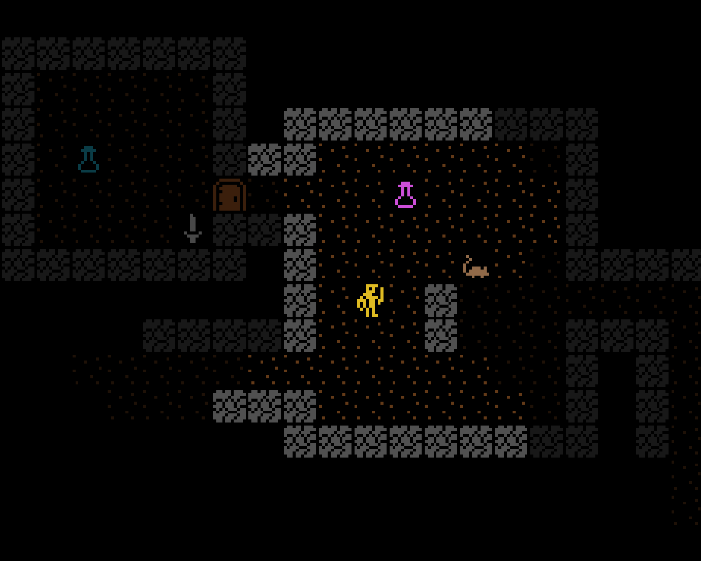

# Go Roguelike

This is a very, very, veeeeery work in progress classic & retro style roguelike being developed in Go targeting WASM for running in browsers.

Nothing more to say here until there's a working prototype 😊

## Project Status

Deployed versions to try out:

- [🕹️ Game](http://code.benco.io/roguelike/)
- [📝 Sprite Editor](http://code.benco.io/roguelike/sprite-editor)

## Screens

## Plan and Todo List

[Tracking all of that here](https://github.com/users/benc-uk/projects/9/views/1)

## Adjunct Side-Side Project Ideas

Ideas for spin off side projects

### Sprite Editor

A separate sprite editor has been developed to aid with creating sprites, it's pure a HTML/JS web app currently contained as a sub-project in this repo

### Sound Effect Engine

Make my own, 8 bit SID like sound engine?

### Music mod player

Make my own? (Probably not, [you've been here before](https://github.com/benc-uk/nanotracker) Ben)
